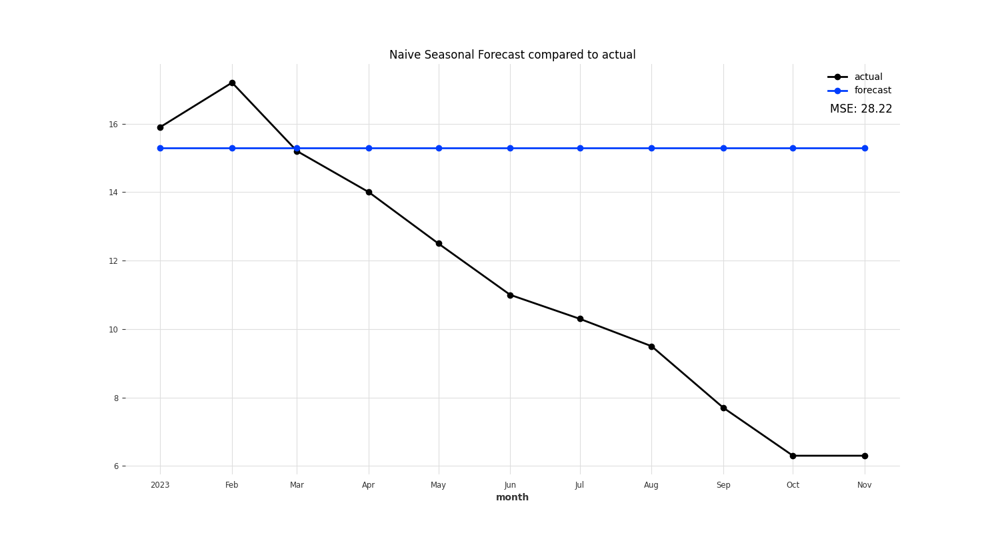
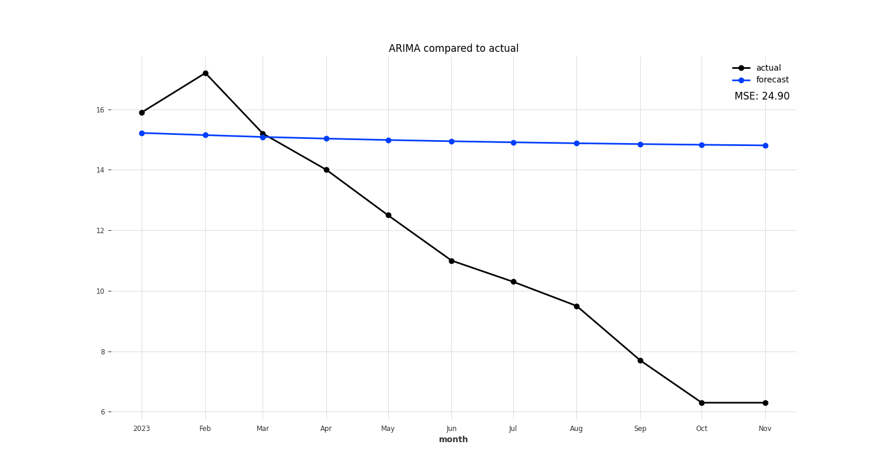
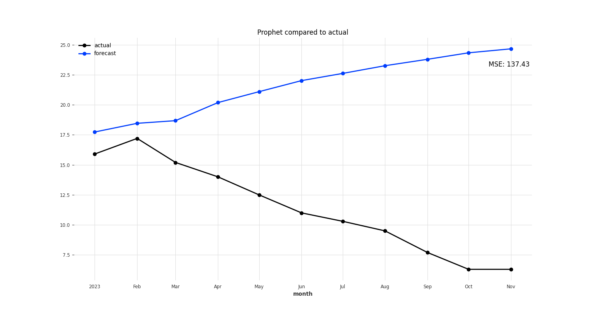
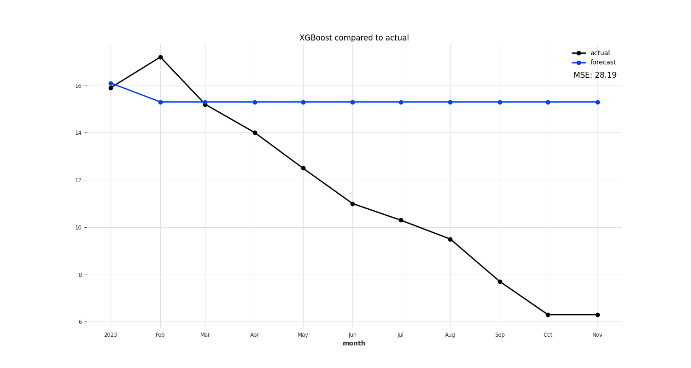
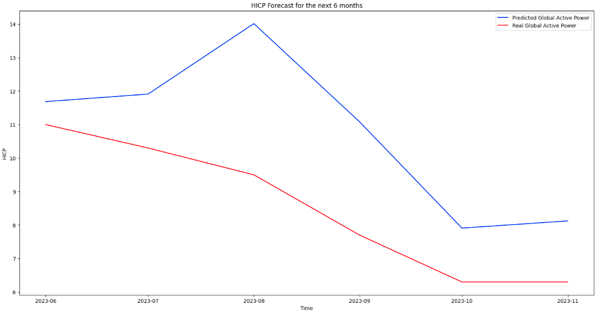

# Predicting inflation in Poland

This project is aimed at predicting future inflation in Poland based on selected economic factors. Predicting inflation
is not an easy task, as it is influenced by many factors, such as the state of the economy, monetary policy, and
geopolitical factors. The project uses several models to predict inflation in Poland, such as ARIMA, Prophet, XGBoost,
and LSTM.

## Installation

The project uses Poetry to manage dependencies. To install the dependencies, run the following command:

```bash
poetry install
```

## Data

The data used in this project comes from the several sources and can be found in the `data` directory. The data is
stored in the `csv` and `xlsx` files. The data consists of the following files:

- Monthly HICP indicators for Poland, Germany, and the Eurozone
- Monthly core inflation in Poland
- Monthly macroeconomic indicators for Poland
- Monthly CPI indicators for the Eurozone
- Monthly CPI indicators for Germany

Why were data from Germany and the Eurozone included in forecasting inflation in Poland?

- Strong economic ties - Poland has strong trade and economic ties with Eurozone countries, and their main trading
  partner is Germany
- Poland has strong trade and economic ties with Eurozone countries, and their main trading partner is Germany
- Impact on export and import - the Eurozone is the main market for Polish goods and services
- Monetary policy - the monetary policy conducted by the ECB has an indirect impact on Poland
- Capital flow - capital movements can affect exchange rates and the level of inflation

# Models comparison

Several models were tested to predict inflation in Poland. The models were evaluated based on the RMSE metric. The
models and result are as follows:

- Naive Seasonal
  

- ARIMA
  

- Prophet
  

- XGBoost
  

- LSTM
  